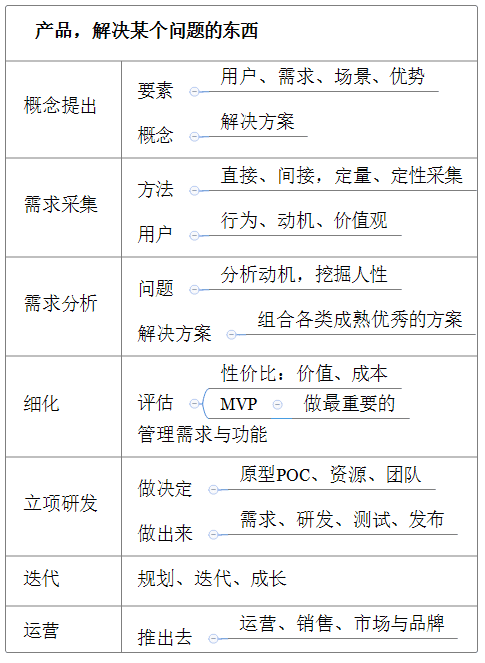

# 产品设计

产品设计是一个由抽象的概念到具体形象化的处理过程，将业务需求或用户需求转换为产品的功能点。通过产品策略、外观、结构、功能为用户提供一个理想的解决方案。最后产品设计还要通过文字或图像等方式将我们规划的产品需求展现出来。

## 设计思想

- 深度转化路径的Y模型

由用户需求转化为产品功能，苏杰的《人人都是产品经理》中提出过一个经典的Y模型理论，它结合了马斯洛需求理论。这个模型是：从用户需求分析出用户的目标，然后分析与结合底层的人性价值观，即可有效、有深度的转化出产品功能。

- “动机、担忧、障碍”模型

在具体的某个产品功能的设计时，需要转换为用户视角，从不同的维度去思考解决方案，需要考虑的几个方面的因素：

动机，创造能解决到用户深层次需求的动机，期待类需求；

担忧，并且使用一些策略降低或者消除用户的使用的担忧；

阻碍，最后还要解决使用中出现的在交互体验上的一些阻碍。

- 内容与数据

对于用户来讲，直观感受到的是产品的功能，有丰富的内容，但是产品的设计角度，数据才是关键，内容的背后是数据的交换与传递。数据主要包括几个环节：

生产，多数由用户来生产，也有系统自动生产，核心是数据生产的可靠性，对输入要进行严格检查，充分考虑用户输入的便捷、效率。

存储，产品设计上需要考虑其定义与分类，然后主要就在实现时的系统设计方案。

消费，也就是信息的展示和计算了。

- MVP

即最小可行产品（Minimum Viable Product），指的是满足“用户愿意用、最好愿意付费”、“用户易于使用”、“团队有能力实现”的最小功能集合。制作的成本极低，但是却能展示最终产品的主要特色。

最重要的是它可以直接接触用户，得到用户的反馈。迭代、敏捷、试错、小步快跑、持续交付等等理念，都与MVP有相似的价值观。

## 解决方案

设计产品功能时，一般从宏观到微观，由顶层到细节进行，大致按三个重点步骤进行：

- 概念设计

设计产品首要的事就是先定义概念，就是概括和抽象用户需求的共同特征和本质特征。可以帮助我们从本质上看待问题，不会被错综复杂的表象干扰。

**概念图**，从整体上体现产品高层概念及其之间的联系，可以用多种形式进行可视化表现，如按概念实体、业务流、信息流、用户操作等各个个维度或组合。

**产品架构图**，直观反映产品的各个模块或子系统关系，指导整体设计及概念抽象。一般设计为分层结构，下层是基础的、共享的、稳定的业务或服务，支撑上层变化的、复杂的业务应用。

**信息架构**，罗列出产品功能的信息内容，即数据。但是并非真正的数据存储结构，仅用来设计模型、分析功能及交互，并用来和相关人沟通。

- 功能流程设计

有了完善的概念，模块规划，就可以进行功能流程设计了，进入功能的各个细节了。详细的设计每个功能点，或者多个功能点组合解决用户的问题，帮忙用户完成目标任务。

先设计产品功能结构图，整理模块中包含的需求，将其结构化为一个一个的功能，并组织起来（或者向下分解为一个一个的功能）。

再配合流程图，梳理出功能的操作流程，流程的效率是关键。其中复杂逻辑还可以有顺序图、状态图、泳道流程图等工具配合。

最后形成的功能细节包括：操作步骤，信息字段，校验规则，流程前置后置条件，异常等等。

- 交互设计

产品功能设计完成后，就需要考虑到用户具体的使用，即产品界面与行为的建模，交互设计。交互是门很深的学问，用户场景与人性化，都是必不可少的基本思想。

一般先构建页面布局和导航，再设计细节的交互。

- 原型

功能模块的设计可用原型来补充，可视化表现。将客户抽象需求可视化的表达方式，可以高效的进行沟通，同时也辅助进行产品概念和产品功能的优化调整。

- 测试

产品功能设计完成后，可以分别进行可行性测试、可用性测试、概念测试，并不断的调整。

## 工具与产出

常用工具：脑图，流程图，UML，Axure。

常见的产出文档：BRD、MRD、PRD，原型，尤其是PRD与原型，并且最新有原型上加上标记来写PRD。

