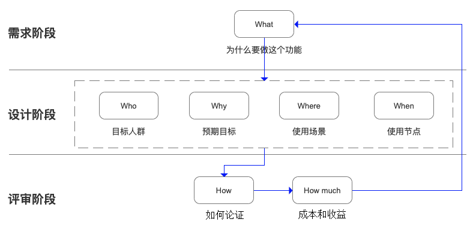

# 解决方案分析的5w2h分析法

5w2h分析法又叫七何分析法，用来发现解决问题的线索，寻找解决思路，进行设计构思，形成新方案或产品。据说是二战中美国陆军兵器修理部首创，广泛用于企业管理和技术活动，对于决策和执行性的活动措施也非常有帮助，也有助于弥补考虑问题的疏漏。

## 分析内容

5w的内容，分别是问题及原因，以及相关的人、时间、地点：

- what，明确问题，以及解决此问题的目的和意义：是什么？目的是什么？做什么事？
- who，涉及的相关方：谁？有谁来承担？谁来完成？谁负责？
- when，时间性，问题发生的时间及频率、解决的时机：什么时间完成？什么时机最适宜？
- where，地点，问题的起因、目标的位置：何处？在哪里做？从哪里入手？
- why，原因，可能的原因、确定的理由：为什么？为什么要这么做？理由何在？原因是什么？

2h的内容，分别是解决方案，以及其成本和收益：

- how to，解决办法，对策和计划、实施及效果：怎么做？如何提高效率？如何实施？方法怎么样？
- how much，费用，解决的投入及收益：多少？做到什么程度？数量如何？质量水平如何？费用产出如何？

## 在产品设计中的应用

- 需求阶段，需要和相关方明确产品的背景目标，以及相关的行业及竞品等等。
- 设计阶段，先要对目标用户、预期目标、使用场景和使用节点进行分析，再做具体的设计。
- 评审阶段，需要反复地进行论证自己的设计，并计算成本和收益。

应用此方法流程化的对产品的设计反复推演及执行，可以找到更根本的问题和更合适的解决方案。用在其他工作上，也能有助于我们的思路清晰并有条理，并可以目标清晰的做事从而提高工作效率。

但是，此方法分析单一问题或最主要问题有效，在处理复杂的问题，或有多个平行因素引起的问题时，难以问出最后的结果。

