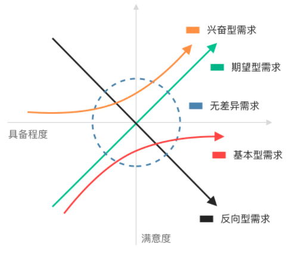

# 需求的满意度模型

KANO模型是东京理工大学教授狩野纪昭（Noriaki Kano）提出的定性分析模型，对用户需求分类和排序的有用工具。主要意义是通过分析用户对产品功能的满意程度，对产品功能进行分级，从而确定产品实现过程中的优先级。

## 按模型进行需求分类

以对用户满意的影响为基础维度，加上功能具备程度维度，**卡诺模型**体现了产品性能和用户满意之间的非线性关系。

- **基本需求**：理所当然的需求，也是用户认为“必须要有”的功能，解决痛点问题的。
- **期望需求**：当提供此需求，用户会满意，用户满意度会降低。体现了产品的竞争能力与质量，是成长期的需求。
- **兴奋需求**：某功能能够实现用户会感到惊喜，不能实现也不会不满，属于期望需求的升级版。用户想不到的潜在需求，需要挖掘/洞察。
- **无差异需求**：功能不论提供与否，对用户体验无影响。
- **反向需求**：功能做了反而会对用户体验产生不良影响。

## 模型分析方法

KANO模型是个定性分析工具，分析方法主要是通过调查问卷进行调研，根据调研结果对各因素属性归类，解决需求属性的定位问题，以提高用户满意度。

问卷调查的设计：

- 大维度两个：提供时的满意程度、不提供时的满意程度。
- 满意程度5级：非常满意、满意、一般、不满意、很不满意。

对获得的信息进行清洗过滤，将需求进行分类，分类的方法是统计需求的分别在提供和不提供时的得分，总和最大的一个属性维度，便是该功能的属性归属。

涉及到多个需求的排序的方法是，按提供时满意从高到低，以及不提供时满意从低到高进行排列。两者系数都排在较高的需求应当优先实施。

这些分析方法涉及到离散分析、连续分析、better-worse分析等方法。

## 总结

产品设计时，需要尽量避免无差异型需求、反向型需求，至少做好基本型需求、期望型需求，如果可以的话再努力挖掘兴奋型需求。

使用KANO模型可以评估产品需求的重要性，也能判断产品的成败。

分析的基础是面向核心用户群体。
