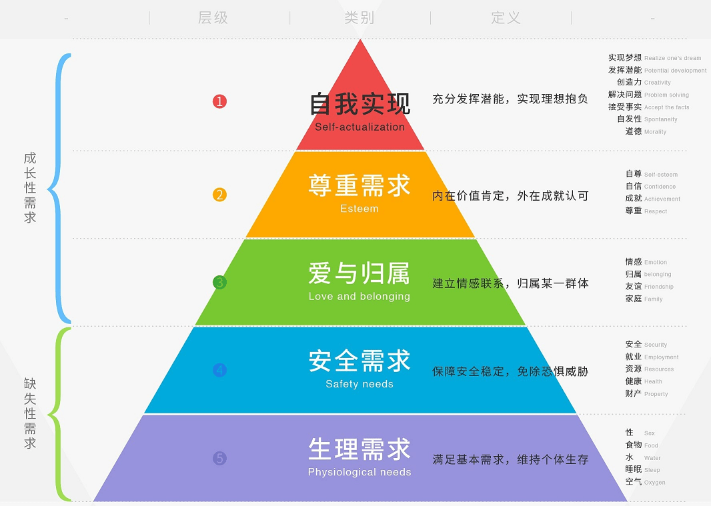

# 需求层次理论

用户有太多的问题需要解决，太多的欲望需要满足，消除现实与理想的差距，就会产生需求。而这些表面需求不断的深挖，总是可以回归到马斯洛需求层次理论。

美国心理学家亚伯拉罕·马斯洛（Maslow.A.H.）从人类动机的角度提出需求层次理论，是动机理论，同时也是一种人性论和价值论。

## 五层次需求

**马斯洛需求层次理论**阐述了人类的五类需求，即从低到高依次分为生理需求、安全需求、社交需求、尊重需求和自我实现需求。

- **生理需求**，人类维持自身生存的最基本要求。
- **安全需求**，期盼稳定、安全、保障而避免灾害、威胁、混乱的需求。
- **社交需求**，要求与其他人建立感情的联系或关系，包括友爱的需要及归属的需要。
- **尊重需求**，基于自我评价产生的自尊和期望受到他人尊重的需求。
- **自我实现需求**，希望最大限度地发挥自身潜能，不断完善自己，完成与自己的能力相称的一切事情，实现自己理想的需求。

## 对需求挖掘的帮助

把握人性是一款产品很重要的一个环节，到底应该挖到那个层面上，作为产品需求，取决于公司和产品的定位。任何产品或服务都是进行商业权衡后满足于用户需求的。

用户在不同的时期表现出来的各种需要，它们的迫切程度是不同的。并且用户在每一个时期，都有一种需求占主导地位，而其他需求处于从属地位。

- 低层次的需要基本得到满足以后，它的激励作用就会降低。
- 高层次的需要比低层次的需要具有更大的价值。

- 需求有一个从低级向高级发展的过程。

从需求的层次分析，可以得到需求的优先级，以及可以制定产品的迭代计划。

