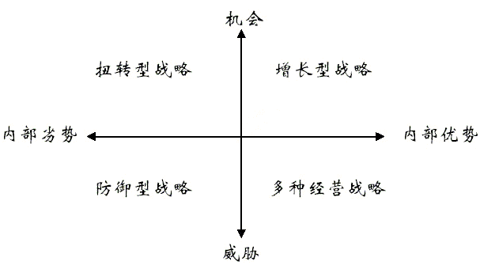

# 需求分析的SWOT分析模型

SWOT分析法也叫态势分析法，20世纪80年代初由美国旧金山大学的管理学教授韦里克提出，经常被用于企业战略制定、竞争对手分析等场合。“S-W-O-T”这四个字母，代表Strength(优势)、Weakness(劣势)、Opportunity(机会)、和Threat(威胁)。

用在产品前期的战略规划中，让项目成员知己知彼，知道自己的产品在行业中所处的位置和核心竞争力是什么，用于产品方向的定位和全方位分析。

## 分析方法

从外部环境分析机会(O)和威胁(T)，从内部分析优势(S)和劣势(W)。在分析时，会把所有的内部因素集中在一起，将外部情况来对这些因素进行评估，着眼于企业自身的实力及其与竞争对手的比较。

- 外部的机会和威胁分析，外部环境是快速变化的，环境中出现的不利的发展趋势成为威胁，这些都需要企业结合实际情况作出合理地应对策略。另外一方面利于自己优势的发展趋势成为机会，需要抓准时机，主动出击。另外还有其他分析方法进行补充：PEST分析、波特的五力分析。
- 内部的优劣势分析，主要分析自身的竞争能力，包括营销、财务、制造和组织等等要素。自身超越其竞争对手的能力就是形成了竞争优势，这个需要识别与维持，必须深刻认识自身的资源和能力，采取适当的措施。

分析过程中，在确定内外部各种因素的基础上，采用杠杆效应、抑制性、脆弱性和问题性四个基本概念进行这一模式的分析。

- 杠杆效应，当内部优势与外部机会相互一致时，可以把握时机，结合机会发挥优势。
- 抑制性，当机会和优势不匹配，优势发挥不出来时，需要追加资源，促进劣势向优势转化，来适应机会。
- 脆弱性，当外部环境有威胁，优势得不到发挥，必须首先克服威胁，让优势能发挥。
- 问题性，劣势与威胁并存时，这就是严峻挑战了。

分析的具体步骤：

1. 确认当前战略。
2. 确认外部环境，主要是行业，竞争对手。
3. 确认自身关键能力和限制，注意是现状而不是前景。
4. 用矩阵表格进行打分，要排布内外各因素的影响级别。
5. 将结果放置在SWOT分析图或表格。
6. 战略分析，制定行动计划。

## 应对策略

SWOT分析有四种不同类型的组合：优势——机会（SO）组合、弱点——机会（WO）组合、优势——威胁（ST）组合和弱点——威胁（WT）组合。

- 机会优势（SO），也被称作是“增长型战略”，抓住外部的机遇，迎接趋势，形成杠杆效应，大力发展。
- 机会劣势（WO），又可被称之为“扭转型战略”，需要借助自身优势，深度追加资源，对劣势资源进行调整，解决其抑制性，迎合机会。
- 优势威胁（ST），又被称作是“多种经营战略”，深度追加资源进行方向转换，进行转型或是衍生发展，在新机会上发挥自身的优势。
- 劣势威胁（WT），也叫“防御型战略”，遇到了最坏的情况，最好是不求发展，只求保全。

SWOT中主导因素是“优势”，但是需要注意各部分进行协同配合。

> 很多时候，企业或是产品发展不好并不是各个模块缺乏优势，而是优势太强、个性太明显才导致最后无法兼容整体。
>
> 就像设计一套系统，A模块和B模块都设计得很出彩，但用户在使用的时候却感觉不到这是一套完整的系统。

