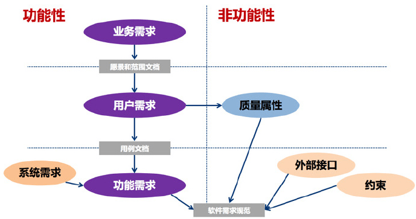

# 需求类型的按对象分层

在对需求进行整理时，经常有这三个层面的需求：业务需求、用户需求、功能需求。

- 业务需求，组织或客户高层次的目标，也就是希望达到的目标。表达的是愿景或范围。
- 用户需求，也叫干系人需求，就是用户的目标，或用户必须能完成的任务。也是产品的价值或特性特征，也包括为了一些业务规则而做的需求。
- 功能需求，必须在产品中实现的软件功能，用户利用这些功能来完成任务，满足业务需求，也就是从业务需求和用户需求经过需求分析的转化而来。
- 以及除了上面三种之外的非功能性需求，也就是质量、约束、可用性易用性可移植性等，或者对外接口集成等。

## 需求三个层面的分析

从干系人的参与的维度看每个需求针对的对象：

- 业务需求，组织高层、客户、市场。
- 用户需求，使用产品的用户。
- 功能需求，产品本身。

分析的步骤一般是：

1. 产品经理或需求分析人员根据高层或市场，确定业务需求。需要更多的关注收益分析。
2. 然后与用户代表一起确定用户需求。关注价值，需要尽量的简单、易用，高效、快捷。
3. 最后分析转化为功能需求，这些与非功能需求一起交付到开发人员。这转化过程建立在对业务场景的充分理解与认知，以及需求点满足策略。

4. 最后的落地阶段，项目经理还会根据产品需求产生项目需求，如实施会用到的设备、文档、支持类环境、培训等等。

在实际工作中，业务需求的权重大于用户需求，会优先考虑业务需求。当两者发生冲突时，可以先界定两者的需求范围，然后尽可能将重叠部分放大，同时兼顾其余部分。

