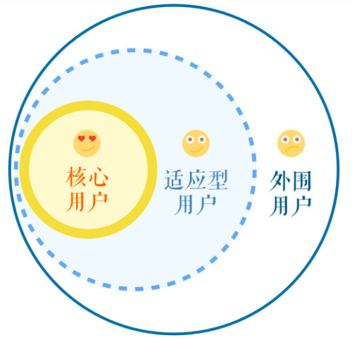

# 需求中用户的分类

用户是群体概念，我们面对这些用户时，看到的不能仅仅是个体，而是有共同特点的群体。不同群体的权重是有差异的，主要体现在群体数量、用户和产品之间的关系、体现在用户的影响力和商业价值方面。

在面对用户时，要看到的不能只是个体，应当是有共同特点的群体。要从群体视角调研并理解需求，为群体服务。

## 简单分类

在产品中或项目中，简单的对用户进行群体分类：

- 核心用户，整个用户群体里的中坚力量，他们对产品的使用带动了其他人的使用，他们对产品的满意度影响着他人的满意度，他们的需求代表着整个用户群体的需求。
- 准核心用户，利益相关方，但不一定与直接产生利益相关，也不一定直接使用产品。
- 临界用户，可能会转移成你的核心用户或者准核心用户，转化策略有增加功能、开发特性、拓展市场等。需要成本，转化率就是用来体现效果的指标。
- 外围用户，可能会偶尔使用产品，可能有各种各样的诉求，我们需要就此做出权衡。

## 按用户圈层区分

- 核心用户，同上概念，需要聚集在此群体的需求，将体验做到极致，将他们的效用最大化。
- 外围用户，同上概念，他们的需求需要做权衡。
- 适应型用户，中间用户，主要特点是跟随和适应。

使用圈层来区分用户，主要作用是找到边界，把自己真正的用户圈出来。并要了解随着时间而变化，圈层也会变化，就可以合适安排产品设计的侧重点。

## 指导需求设计

希望讨好所有人的结果，是所有人都无法真正满意的结果。在设计中做出权衡时，核心用户群体需要首先被考虑到。

用户需求可能采集广泛的用户代表需求，但落地的产品需求一定是专注于某一个特定用户画像来进行设计。产品的边界就是核心用户的那个圈，会直接决定产品或服务的方向和资源分配，也就是定位。

注意产品的演进需要注意会影响用户的变化，反之用户变化时，也需要调整产品的迭代计划。

注：运营阶段，会涉及到的用户分类还会是潜在用户、目标用户、种子用户。
