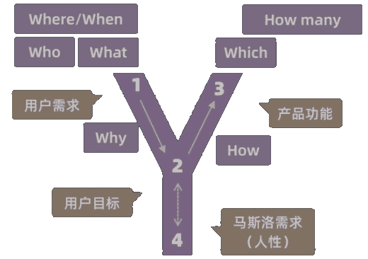

# 需求分析的Y模型

需求分析是从问题到方法的转化，或者是从用户需求到产品功能的转化。分析过程就是从现有的问题、用户提出的需求出发，挖掘用户内心真正的目标，并转化为产品需求的过程。

关于需求的理解与挖掘，比较经典的产品经理的书籍，苏杰的《人人都是产品经理》中提出过一个经典的Y模型理论，将需求分析的分为三种层次深度，并将分析路径总结为“Y”模型。

## 需求的层次

需求分析应当有层次的进行，分析的层次深浅直接决定分析的质量，而会影响最终方案是否可以真正解决用户的问题。

三个层次分为：

- 第一层次，用户的观点和行为，听用户怎么说，看用户怎么做。
- 第二层次，用户的目标和动机，说的和做的具体目标和原因是什么。
- 第三层次，用户的人性价值观，是需求的本质，最深层次、最底层、最稳定的需求，属于高度概括的层次。

## Y模型

结合马斯洛需求理论，模型的“Y”的上面两个端分别是用户需求与产品功能，交叉点是用户目标，最下方是人性需求。

- “1”，用户需求，对应观点和行为，需求的起点。
- “2”，用户目标，对应目标和动机，一定要分析到这个深度。
- “3”，产品功能，是解决方案。
- “4”，人性价值观。

不同的阶段回答的问题（6个W和2个H）是：

- Who（用户）。
- What（需求）。
- Where/When（场景）。
- Why（动机），为什么要这么做。
- How（解决方案），解决问题的若干方案。
- Which（选择），选择哪个方案。
- How many，当前做多少个功能。

## 分析步骤

分析的两大步骤：

- 1（用户需求）-> 2（用户目标）-> 4（人性），进行定性分析、深入洞察、挖掘人性。
- 4（人性）-> 2（用户目标） -> 3（产品功能）或2->3，将用户目标与产品目标结合、将用户任务与产品功能结合。

问题研究时和设计解决方案时的思维需要在新手与专家思维中切换。

- 面对“问题”时要像新手，要不断发现新的问题和可改进之处，不要固化了思维，主要指心态上。
- 设计“解决方案”时必须成为专家，主要指能力上能“从现象到本质”。

在分析问题与解决问题的时候，经常遇到“问题”与“方法（解决方案）”，并带出来的“问题中心（Problem Centering）”与“方法中心（Means Centering）”这两个概念。在产品设计过程中要融合这两种思维，先研究问题后设计方法。

- 问题中心，这个思路出发，搞定问题什么方法都行。
- 方法中心，解决之道在方法本身，一个方法解决多种问题。