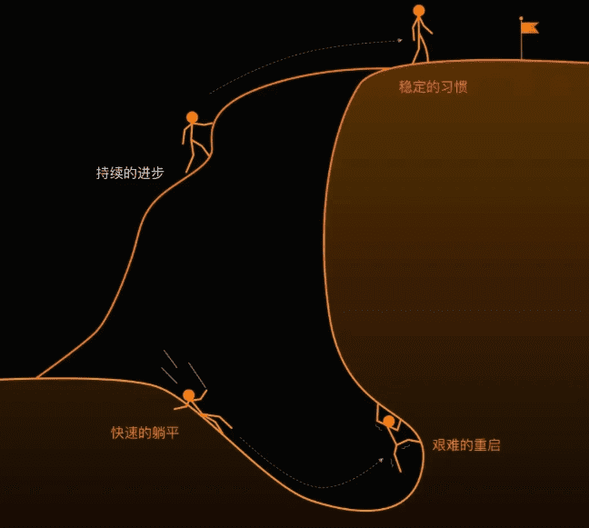

# 自律-坚持做正确的事

> 做正确的事比正确地做事更重要。
>
> ——《麦肯锡思维》

## 正确的事

所谓正确的事，不同的人可能会有不同的看法和标准。一般来说，主要体现在这三个方面：

第一、符合自己的价值观或目标。这事是自己有兴趣的喜欢的，内心对他认同的。在大的方向一定要符合人类普遍价值观。

第二、具有长期价值。做好这事能在相当长的时间上起作用，不是那些即兴的小事，不追求短期利益。

第三、能发挥自己的长处。努力后能够做得了的事。认清自己的长处，把握好自己的长处，让自己做擅长的事，才能获得竞争性优势。

首先要建立正确的价值观，认识这个世界，知晓社会前进的方向以及需求。其次是对自己有深刻的认识，清楚自己的优点和缺点。再找到正确的事不断的重复做、不断更新自己的理念。

如在职业规划中，兴趣、能力、价值观、社会需求这四个要素的交集部分，就是职业发展的最佳方向，也就是正确的事。

> 所谓简单的事，就是“捷径”，是那些大多数人都会做的事；所谓难的事，往往就是“布满荆棘的路”，是那种你不坚持很容易，坚持会很难的事。
>
> ——稻盛和夫

## 自律

就像很多投资家常说的那句话，长期做正确的事情，一定能够有所收获。

自律，是一场关于自我的重塑。从自我约束出发，到达习惯的终点，才会获得自由，体会到自由。

培养自律的一个非常简单有效的方法，就是习惯。将看起来比较困难的改变，分解成很小的部分，坚持重复做，日积月累，就会在无形中潜移默化的改变自己。

以下几个重要的事情要做到：

- 1，制定目标和计划。明确目标，分解，制定计划，从小目标出发逐步实现最终的大目标。
- 2，排序紧急重要等级。
- 3，坚持执行，按时完成，避免拖延。
- 4，良好的习惯：早起、饮食均衡、运动、阅读。
- 5，管理时间。
- 6，学会放松与调节情绪，每天做一些快乐的事，不给自己焦虑。
- 7，坚持反省。
- 8，坚持正反馈，自我激励。
- 9，花时间提升自我管理能力。

