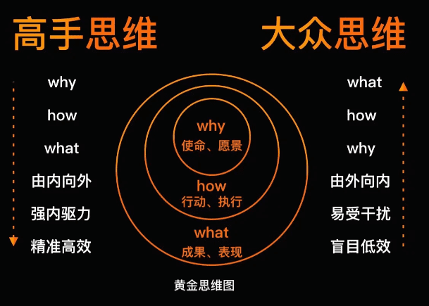

# 追问问题的本质，黄金思维圈

> 人们买的不是你的产品；人们买的是你的信念。 你的行动只是证明了你的信念。 实际上，人们会去做能够体现他们的信念的事情。 
>
> ——西蒙·斯涅克

所有的人，遇到问题，怎么思考和处理的呢，一般有两种方式。

- 看到了是什么，或者也想到了怎么做。
- 追问到了问题的本质，知道了为什么会出现这问题。

前者，可能能解决了问题的表象，但是有可能会陷入到低效勤奋。或者用了错误的方法无法根本性的解决问题。后者则可以更加透彻、全面，解决问题也会更快速。

人与人最大的区别，就是思维方式，思维方式的不同造就了我们做事情方式的不同，最后带来结果的不同。优秀的人都是善于思考的人，他们会比一般人看的更深、看的更远。

> 如果你想造一艘船，先不要雇人去收集木头，也不要指挥他们做这个做那个，你只要教他们如何渴望大海就够了！
>
> ——《小王子》

## 黄金思维圈

所谓黄金思维圈代表着事物的三个层次：

- 最外层是What，即做什么，是指事物表现出来的具体表象；
- 中间层是How，即怎么做，是指实现事物的方法和措施；
- 最里层是Why，即为什么，是指事物的目的和理念。

内圈的概念是蕴含在外圈内部的，你需要层层剥开外圈，才能触及内部核心的东西，就剥洋葱一样，不断触及核心。当触及核心之后，思考的高度、深度和广度已经可以让你能够透过问题的表象看到本质，解决问题所需的办法也就信手拈来。

黄金思维圈本质是要求我们在开始行动之前，要从 WHY 的角度出发，先问为什么，也就是弄清目的是什么之后，再开始去行动，只有把这个问题搞清楚，你才可能找到正确的方向和方法。

> “如果让我做一件事，我会花95%的时间考虑为什么做，剩下5%的时间去做。”

大众思维是由外向内做事，其实是思想上的懒惰，表面的事意味着直接和简单，但往往也意味着偏差和错误。需要有一定的逻辑力和思维力，不停的问题为什么，才能跳出各种各样的表面迷雾。

要理解停留表层的三个特点：

- 消除了表面的麻烦。往往这是简单直接、见效快，但只是暂时掩盖问题罢了。
- 单维度问题。从外向内看，往往只有单一维度或某一方面而已，如果内向外看，则会有条条大路通罗马。
- 专注在表面的解决方案。如果精力投入到表面问题的解决上，那么就没精力放到核心问题上去了。

人们天生喜欢简单，当遇到上面三种情况，都应当警惕，都应当思考一下，是不是在最外层转圈圈。就应该提醒自己启用“黄金思维圈”了。

