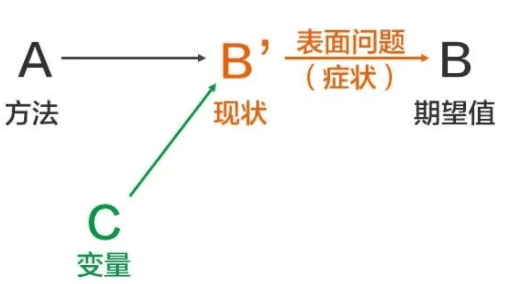
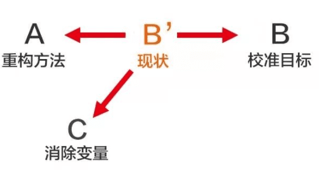

# 正确的问题和分析正确答案

## 1，问题是什么？

问题就是：期望与现状的落差部分。

假设某件事的期望值是（B），预期使用的方法是（A），但是现状是（B’），那么（B'→ B）这个落差部分，就是问题。

## 2，如何描述一个问题？

第一步：明确期望值（B）

> 前提是目标是可衡量的。要遵循SMART原则。

第二步：精准定位现状（B’）

> 事实是客观的，它有真假之分。事实是真实发生的事情。
>
> 观点是主观的，它没有真假之分。观点表达了个人的价值观和兴趣偏好。

第三步：用（B'→ B）这个落差，精准描述问题

> 一个问题，就像是一盏路灯，只会照亮下方的特定区域。

## 3，如何寻找本质问题？

- **找表面的问题**：

从现状（B’）出发，找寻一条从（B’→ B）的路径（答案）。

可能结果：回答了表面问题，忽略了本质问题。

> 治标不治本。

- **找到本质问题** ：

第一步：要掌握足够的信息来精准地描述问题 。

第二步：分析（B’）为什么会产生，本质或许在其中。可能的因素有三个：

- 错误的方法（A）？
- 过高的期望值（B）？
- 出现新的变量（C）？

> 要解决这个问题，不能盯着（B'→ B）看，而是要透过（B’）去看ABC，《认知红利》书中称之为透析三棱镜。

## 4，解答

找到了本质问题后，根据方法（A）、期望值（B）、新变量（C）的问题，解决方案也就有了针对性。

第一步：校准目标，设立目标时一定要遵循SMART原则。还得注意区分目标和手段。

> 目标不对，什么都不对！

第二步：重构方法，方法（A）包括了与之相关的人、事、物，就是要将这些内容进行重新改变或组合。

> 调整方法，需要大量的背景知识和正确的思维方式，才能找到适合的解决办法，每个问题都有其独特性和不同的时空背景，需要具体问题具体分析。

第三步：消除变量，最后就是出现了新变化了，挖掘新变量的相关信息，基本思考框架是：有个现象，找到现象后面的数据，然后根据数据分析原因。

> 寻找背后的原因，5Why分析法，对一个问题点连续以5个“为什么”来自问。