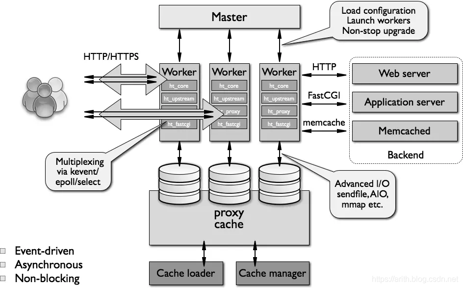
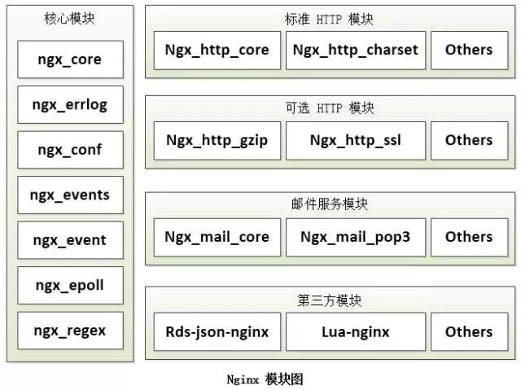

# Nginx高性能的Web及代理服务器

Nginx是一款轻量级的Web服务器/反向代理服务器及电子邮件（IMAP/POP3）代理服务器，在一个BSD-like开源协议下发行。由俄罗斯的程序设计师IgorSysoev在2002年开始开发，2004年第一个版本发布后就开始流行开来，现在是使用量最大的Web服务器之一，并不多1/3的网站在使用Nginx。在国内的社区分支主要是淘宝团队开发的Tengine。官方提供的有免费版本和商业版本。

## 重要的特性

- 高可靠性，多个进程，单 Master 管理多 Worker 模式，Worker如果死了会启动新进程，保证可用。

- 高可扩展性，所有功能都高度抽象模块化。

- 高性能，异步非阻塞请求模型与事件驱动，最大程度的提升连接数和处理能力，并保持最低的内存消耗与CPU占用。

- 支持热部署，可以很久不用重启，并不停机更新程序。

## 典型应用场景主要有这几方面

- **静态文件服务器，图片处理**，作为web服务器，同时支持虚拟主机、keepalive、访问日志等。
- **代理，反向代理，负载均衡**，四层和七层代理，和多种负载均衡算法，还有url rewrite重写、路径别名等。
- **安全防御，防盗链**，可以控制ip访问控制，支持速率限制及并发数限制等。
- **智能路由，灰度发布**
- **静态化，缓存**
- **消息推送**

## Nginx的进程

Nginx 里有一个 master 进程和多个 worker 进程。master 进程并不处理网络请求，主要负责调度工作进程：加载配置、启动工作进程及非停升级。worker 进程负责处理网络请求与响应，多个worker进程相互独立，不加锁，这个机制可以提高性能并确保服务不会因某个进程故障而服务不响应。worker进程以异步非阻塞方式和事件驱动模型工作，可以处理多个客户端请求。

- master进程职责：响应客户端请求、将请求转发给worker、监控worker状态，当worker异常时重启新进程。
- worker进程职责：多个进程对等独立处理客户端的请求。

## Nginx的模块

高度模块化的设计是 Nginx 的架构基础。Nginx 服务器被分解为多个模块，每个模块就是一个功能模块，只负责自身的功能，模块之间严格遵循 “高内聚，低耦合” 的原则。

- 核心模块：提供核心功能，如日志、配置、事件驱动、进程管理等。
- 标准HTTP模块：对HTTP协议进行解析，包括端口、编码、响应头等。
- 可选HTTP模块：扩展HTTP功能，如SSL、压缩、多媒体等。
- 邮件模块：可支持包括对 POP3 协议、IMAP 协议和 SMTP 协议等等。
- 第三方模块：开发者自定义功能，最常见的如Lua等。

## 高性能高并发的核心

- **事件驱动模型**： 由事件收集器、事件发送器和事件处理器三部分基本单元组成。事件处理器I/O多路复用机制处理IO请求。
- **epoll**：I/O操作都能在一个线程内并发交替地顺序完成，epoll（IO 多路复用select/poll的增强版本）可以支持大量链接，主要优化大量并发连接中只有少量活跃的情况下的系统CPU利用率。linux实现了epoll特性。
- **mmap**：在内存中共享存储映射，mmap系统调用使得进程之间通过映射同一个普通文件实现共享内存，进程可以直接读写内存，不需要任何数据的拷贝；即epoll使用mmap减少复制开销。
- **sendfile**：零拷贝，在内核中从内核缓冲区直接复制到内核的socket缓冲区，从而避免了数据在内核缓冲区和用户缓冲区之间的拷贝。

