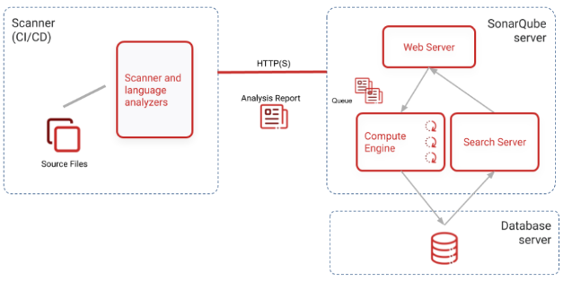

# 代码质量管理工具-SonarQube
SonarQube 是一个代码分析平台，用来持续分析和评测项目源代码的质量，他使用Java语言开发，开源，托管在Github上。它通过定义好的规则对代码进行扫描和分析，并将结果多维度的展示出来。

## 主要特点

- 可以分析代码量、安全隐患、编写规范隐患、重复度、复杂度、代码增量、测试覆盖率等。

- 能对现在多数流行编程语言的代码进行扫描和分析，包含java、python、C#、javascript、go、C++等。

- 主要是静态扫描规则。
- 能与多数SCM、IDE、CI/CD平台集成，如Idea、Jenkins、Gitlab等。
- 有大量的插件，比如checkstyle，findbugs，pmd等等。

## 系统组成

SonarQube由两部分组成，一个是web界面管理平台，另一个是sonar-scanner扫描器。

- web界面管理平台，主要是展示数据和配置各种规则、项目、通知，以及配置各种插件和仓库。
- sonar-scanner扫描器，扫描和分析各类代码，并存储到数据库中。

新版的Sonar支持PostgreSQL、Oracle、SqlServer等，不支持Mysql，支持H2内存数据库但只能在测试环境中运行。

Sonar Scanner，主要运行在开发人员的代码端，可以单独部署，也可以集成在Maven，Gradle等。

## 代码质量

代码质量是团队技术水平和管理水平的直接体现。指的是代码本身的质量，包括复杂度、重复率、代码风格等要素。

SonarQube可以从以下七个维度检测代码质量：

- 不遵循代码标准。主要是PMD,CheckStyle,Findbugs这几个工具。
- 潜在的缺陷。同样是那些插件工具检测Bug。
- 糟糕的复杂度分布。文件、类、方法等，复杂度过高将难以理解与修改。
- 重复。大量复制粘贴是质量低下表现。
- 注释不足或者过多。
- 缺乏单元测试。
- 糟糕的设计。

## 扫描项目的方式

SonarQube通过多种插件完成对不同环境的集成。常用的扫描方式有：

- Sonar Scanner for Maven的Maven插件。在开发者本地pom.xml或settings.xml中加入插件，即可使用mvn sonar:sonar命令进行扫描。结果会自动上传SonarQube Server。
- Sonar Scanner for Jenkins的Jenkins插件。在Jenkins服务器端安排插件，配置服务器参数，再配置Jobs，对项目代码拉过来扫描，结果上传到SonarQube Server。
- GitLab/GitHub集成，安装sonar-gitlab-plugin，打通两平台互通，再通过GitLab CI Runner让提交代码时即可检查代码质量，并上传到SonarQube Server。