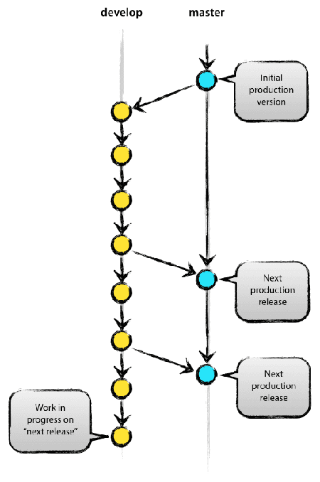
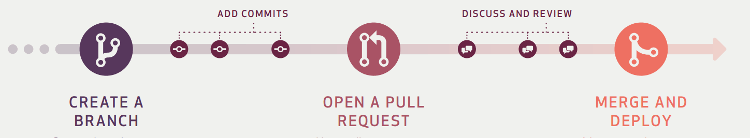
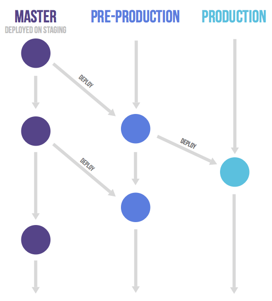

# 使用Git管理代码仓库-分支使用

> *分支策略*

1. 常见分支：主分支 master，初始化时默认就会有master分叉。
2. “功能驱动式开发”：先有需求再有功能分支或者补丁分支，合并主分支后删除工作分支。
3. 常见的策略：Git flow（master+develop），Github flow（master持续发布），Gitlab flow（主分支master作“上游”）。

> Git flow（master+develop“版本发布”）

1. 主分支：用master分支稳定的发布版本，平时不能在上面干活，并且设置保护，不可提交。
2. 开发分支：develop，存放最新的日常开发版。不可删除。
3. 如果要发布版本，就在Master分支上，对Develop分支进行“合并”（merge）。注：最好选择“快进式合并”。
4. 临时分支和功能分支和预发布分支：是从Develop分支上面分出来，工作结束，合并到Develop分支并删除。
5. 修补bug分支：从Master分支上面分出来，工作结束，合并到Master分支和Develop分支并删除。

注：基于“版本发布”的 Git flow 是最早诞生、并得到广泛采用的一种工作流程。比较复杂。

> Github flow（master“持续发布”）
1. 只有一个长期分支，就是 master 。
2. 从 master 拉出新分支，不区分功能分支或补丁分支。
3. 新分支工作结束，向 master 发起“merge request”。评审后接受代码，代码合并进 master 。发布后，删除此分支。

注：基于“持续发布”的 Github flow 比较适合网站或平台项目类。另外需要再配置一个发布跟踪分支，跟踪发布的版本。

> Gitlab flow（主分支master作“上游”）
1. 只存在一个主分支 master ，是其他分支的"上游"。合并后，才会到其他的分支。
2. “持续发布”的项目，在 master 分支以外，再建立不同的环境分支。开发有“开发分支”（master），生产有“生产分支”（production）。
3. “版本发布”的项目每一个稳定版本，都要从master分支拉出一个分支，修补bug时将代码合并到这些分支。版本号需要规划。
4. 代码的变化，必须由"上游"向"下游"发展。如生产有BUG，新建BUG分支从“开发分支”出来，工作结束后，合并到“开发分支”，cherry-pick（选择合并）到“生产分支”。没有问题删除BUG分支。
5. 紧急情况下，BUG分支可直接到“生产分支”或其他分支。再到“开发分支”。
6. cherry-pick：选择几个提交（commit）到指定分支。

注：Gitlab flow 是 Git flow 与 Github flow 的结合。最大原则叫做"上游优先"（upsteam first）。只有上游分支采纳的代码变化，才能应用到其他分支。

---
> 人员协作方式

1. 集中式工作流：每人按次序提交数据，提交前先更新并解决冲突。和SVN类似。团队成员少时简单快速，也不用太多分支。
2. 集成管理员工作流：有项目维护者和贡献者。
    - 项目维护者维护基准项目仓库（blessed repository），可直接提交；
    - 贡献者克隆到自己的仓库，并维护此仓库，工作结束后，请求维护者拉取自己的修改。
    - 维护者把贡献者的仓库加为本地的远程仓库，本地测试完成后，提交到基准项目仓库。
    - fork 也是克隆。

3. 司令官与副官工作流：有特定部分的集成管理员（副官）和负责统筹的总集成管理员（司令官）。还有开发者。
    - 超大型的项目使用，如linux。
    - 副官合并开发者的分支到自己的主干分支。
    - 司令官合并副官的分支到自己的主干分支。再推送到基准项目仓库。

> 注：

小团队时集中式工作流；大项目选择集成管理员工作流；司令官与副官工作流不常见。
