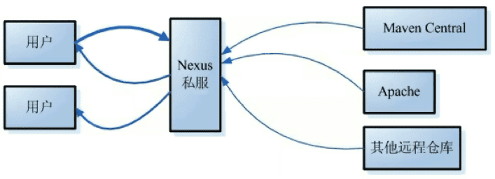

# Maven仓库Nexus的部署

Maven 仓库是项目中依赖的第三方库，这个库所在的位置叫做仓库，能帮助我们管理构件（主要是JAR）。一旦工程需要依赖哪些jar包，只需要在Maven的 pom.xml 配置一下，该jar包就会自动从仓库引入到工程目录。

## 仓库类型

仓库为两类：本地仓库和远程仓库，工程上依赖的Jar包首先在本地找，不存在就上远程仓库找。远程仓库中又分成了3种：中央仓库 、私服、其它公共库，私服主要是代理缓存，用在内网还可以管理自己的公共Jar包。

1. 本地资源库：本地存储项目的依赖库，默认的文件夹是用户下 “.m2” 目录。
2. 中央存储库：Maven用来下载所有项目的依赖库的默认位置。
3. 私服：特殊的远程仓库，代理广域网上的远程仓库，内网使用，部署自己的构件或者三方的构件。



## 安装Nexus

目前常用的搭建 Maven 私服的服务器有3种：Apache Archiva、JFrog 的 Artifactory 和 Sonatype 的 Nexus。其中Nexus是其中广泛使用的开源Maven仓库管理器，一般都会有它搭建公司内部或者团队内部的 Maven 私服仓库。

Nuexus3能够支持Maven、npm、Docker、YUM、Helm等格式数据的存储和发布，并且能够与Jekins、SonaQube和Eclipse等工具进行集成。

以Linux centos8为例安装配置Nexus3：

**一，准备环境**

1. 需要Java8。
2. 剩余内存2G以上，最低 heap size 2703MB，实际2G也可以正常运行。
3. 存储、CPU基本上没要求，同时Blob storage可以支持S3这种存储。
4. 准备nexus用户，因为不建议直接使用root启动。
5. 准备Nexus安装包，Nexus3与Nexus2有很大的不同，另外Nexus3到3.14.0版本都有远程命令执行漏洞，可能会被种挖矿病毒，最好跳过这些版本。

```shell
# Java8
yum install java-1.8.0-openjdk
# user 密码可选（passwd nexus）
useradd nexus
# download
wget https://download.sonatype.com/nexus/3/nexus-3.38.1-01-unix.tar.gz
# 可能要调整linux参数
# 文件打开数
vi /etc/security/limits.conf
# 加入
nexus - nofile 65536
# 开防火墙 nexus默认端口 8081
sudo firewall-cmd --zone=public --add-port=8081/tcp --permanent
sudo firewall-cmd --reload
```

如果下载不了，有个下载网站可用 https://d.serctl.com ，可以中转一下。

**二，安装**

安装很简单，解压，修改配置，即可运行。解压之后会有两个文件夹：nexus 和 sonatype-work，前者是程序，后者是数据目录。基础配置在nexus-default.properties，运行参数等配置在nexus.vmoptions。

```shell
# 准备目录
mkdir -p /data/nexus
chown -R nexus:nexus /data/nexus
chmod 777 -R /data/nexus
# 切到nexus用户，解压
su nexus
tar -zxvf nexus-3.38.1-01-unix.tar.gz -C /data/nexus
# 修改配置
# 运行用户
vim ./bin/nexus.rc
# 加上
run_as_user=nexus
# 修改端口
vi ./etc/nexus-default.properties
# 默认也是8081
application-port=8081 
application-host=0.0.0.0
# 修改内存
vi ./bin/nexus.vmoptions
# 修改
-Xms1024m
-Xmx1024m
-XX:MaxDirectMemorySize=2G
```

**三，运行**

./bin/nexus {start|stop|run|run-redirect|status|restart|force-reload}

run和start区别是前者在当前进程运行，后者是以守护进程运行。

然后访问8081端口，就可以看到登陆页面了，默认用户密码是admin/admin123，首次登陆会提示修改密码。

**四，注册为系统服务**

创建/usr/lib/systemd/system/nexus.service文件

```shell
[Unit]
Description=Nexus daemon

[Service]
Type=forking
LimitNOFILE=65536
ExecStart=/data/nexus/nexus-3.38.1-01/bin/nexus start
ExecStop=/data/nexus/nexus-3.38.1-01/bin/nexus stop
User=nexus
Restart=on-abort

[Install]
WantedBy=multi-user.target
```

添加启动项，就可以运行了。

```shell
systemctl daemon-reload
systemctl enable nexus.service
# 启动
systemctl start nexus.service
systemctl status nexus.service
```

**附：其他**

Docker安装最简单，直接使用sonatype/nexus3镜像拉起即可。

```shell
docker pull sonatype/nexus3
docker run -d --name nexus3 --restart=always -p 8081:8081 -p 8082:8082 -p 8083:8083 -p 8084:8084 -p 8085:8085 sonatype/nexus3
```

nexus的备份就是将sonatype-work文件夹备份即可。

小版本的升级则是直接用新版本的nexus文件夹即可，大版本的升级则需要使用在 Nexus 3.x 中的 Upgrade 功能。

