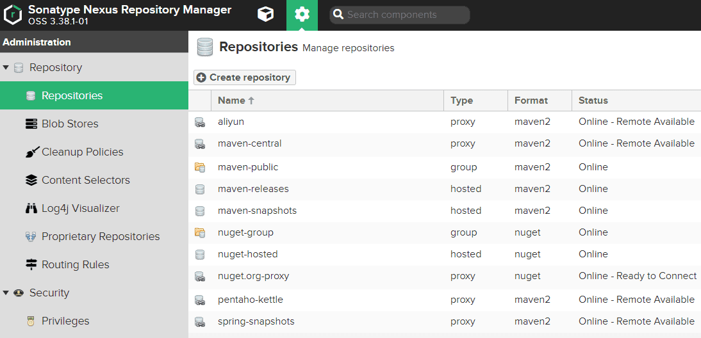

# Maven仓库-Nexus的配置使用

Maven 作为 Java 项目管理工具，一方面管理Jar包，另外可以通过插件，做整个项目的开发、打包、测试、部署等一系列管理。

Nuexus3不只是做Maven仓库了，同时也能够支持npm、Docker、YUM、Helm等格式数据的存储和发布，并且能够与Jekins、SonaQube和Eclipse等工具进行集成。

## 仓库配置

安装完成后，就有几个默认的仓库，一般情况够用了。



系统中有三种类型的仓库，不管是Maven，还是npm、Docker都可配置这几类：

- proxy，代理，用来代理中央仓库的。
- hosted，本地私有的库了，管理公司或团队内部的包。还会再分为 releases 和 snapshots 两个，前者用于稳定版，后者用于开发测试版。并且一般情况下前者都不请允许同版本号覆盖Jar包的。
- group，组合，把多个仓库组合起来，方便项目使用。

创建仓库时的重要的参数：

- 唯一的仓库名。
- Maven的版本策略有Releases、SNAPSHOT、Mixed，mixed是混合的。
- Storage，大对象存储（支持S3和本地File类型）。

- proxy类型仓库要代理的仓库url，如阿里云的仓库地址是：http://maven.aliyun.com/nexus/content/groups/public/。
- hosted一般默认就足够用了。
- group类型仓库，只用选择需要组合的成员仓库。
- 可选的清理策略。

## 用户权限

安装完成后，默认用户密码是admin/admin123，首次登陆会提示修改密码。

系统中默认的角色和用户都有两种，admin、anonymous，管理员和匿名游客。一般情况可以把匿名访问功能关闭。

仓库的权限有：add:上传权限、browse:浏览权限、delete:删除、edit:编辑、read:读取详细信息。

## 项目的Maven仓库

配置生效的优先级：

> pom.xml > /home_dir/.m2/settings.xml > /maven_dir/conf/settings.xml 。

仓库镜像配置规则：

> maven有个默认的仓库，ID为central，默认值是https://repo.maven.apache.org/maven2/。
>
> mirror是镜像，而不是“分库”，无法连接就找下一个，如果没Jar包，则直接报错。
>
> mirror按字母顺序，并非配置先后顺序，注：repositories则是配置的先后顺序的。
>
> mirrorOf=*，就会替代所有仓库。
>
> mirrorOf=central，就会替代默认的中央仓库。
>
> mirrorOf=central 有多个，则按顺序只会获取第一个。
>
> mirrorOf=*,!repo1，则是代理所有，除repo1外。

仓库生效的优先级是：

> local_repository > settings_profile_repositories > pom_profile_repositories > pom_repositories > settings_mirror > central。
>
> 当一个 repository 存在 mirror 时，一定使用的是 mirror 配置的地址。

首先配置本地maven的仓库的私服地址，可选在conf或.m2中的settings.xml的mirror、项目的pom.xml配置，还各处都可以配置的profile。

pom.xml中的配置，其中的url是nexus中仓库url。

```xml
<project>
<!--方式1，repo参数-->
  <repositories>
    <repository>
      <id>nexus-central</id>
      <name>my central</name>
      <url>http://xxx:8081/repository/maven-public/</url>
      <releases><enabled>true</enabled></releases>
      <snapshots><enabled>false</enabled></snapshots>
    </repository>
  </repositories>
  <!--... pluginRepositories ...-->
<!--方式2，profile参数-->
  <profiles>
    <profile>
      <id>spring</id>
      <repositories><!--同上--></repositories>
      <!--... pluginRepositories ...-->
    </profile>
  </profiles>
</project>
```

settings.xml的仓库地址，加入镜像结节配置，其中的url是nexus中仓库url。

```xml
<!--方式1，镜像代理，mirrorOf=*情况，最高优先级-->
<mirror>
  <id>nexus-central</id>
  <mirrorOf>central</mirrorOf>
  <name>my central</name>
  <url>http://xxx:8081/repository/maven-public/</url>
</mirror>
<!--方式2，profile参数，最优先-->
<profiles>
  <profile>
    <id>spring</id>
    <repositories><!--同上--></repositories>
    <!--... pluginRepositories ...-->
  </profile>
</profiles>
```

## 部署自己的Jar包

首先需要在setting.xml文件加入server，否则没有权限上传jar。

```xml
<server>
  <id>nexus</id>
  <username>admin</username>
  <password>admin123</password>
</server>
```

再在项目的pom.xml文件中加入distributionManagement。

```xml
<distributionManagement>  
  <repository>    
    <id>nexus</id>    
    <url>http://xxx:8081/repository/maven-releases/</url> 
  </repository>  
  <snapshotRepository>  
    <!--上传快照-->  
    <id>nexus</id>    
    <name>Nexus Snapshot</name>    
    <url>http://xxx:8081/repository/maven-snapshots/</url>  
  </snapshotRepository> 
  <site>   
    <id>nexus</id>    
    <name>Nexus Sites</name>   
    <url>dav:http://xxx:8081/repository/maven-snapshots/</url>  
  </site>
</distributionManagement>
```

上传：项目中mvn deploy即可。如果只有Jar文件则：

```shell
mvn deploy:deploy-file \
-DgroupId=xxx.xxx \
-DartifactId=xxx \
-Dversion=0.0.1 \
-Dpackaging=jar \
-Dfile=D:\xxx.jar \
-Durl=http://xxx:8081/repository/nexus/ \
-DrepositoryId=nexus
```

也可在管理页面上的Upload菜单中进行。

